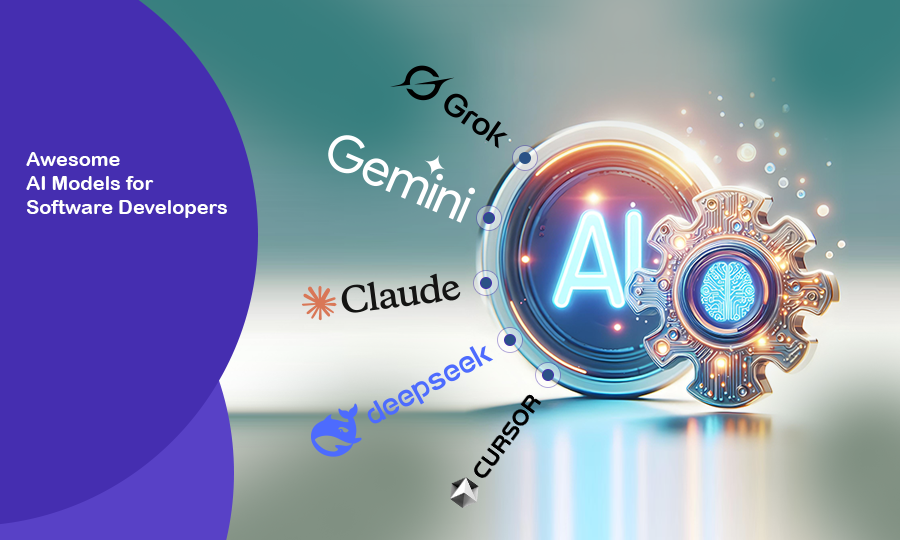
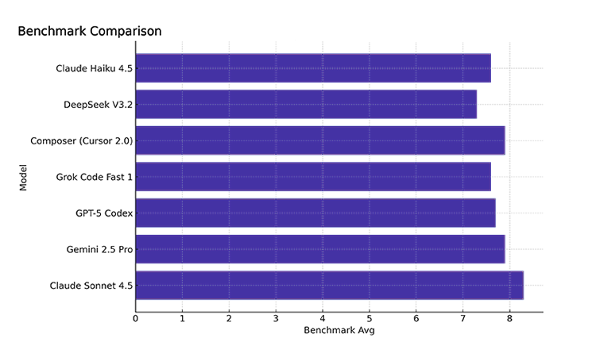

# Awesome AI Models for Software Developers

In 2025, AI models have become indispensable tools for developers, automating complex tasks and enhancing productivity. Drawing from the latest benchmarks and user insights, this article focuses on a curated list of top AI models: Claude Sonnet 4.5, Gemini 2.5 Pro, GPT-5 Codex, Grok Code Fast 1, Composer (Cursor 2.0), DeepSeek V3.2 & Claude Haiku 4.5.

These models represent cutting-edge advancements, with surveys showing 52% of developers reporting productivity gains from AI tools.

However, challenges like output distrust (46%) underscore the need for balanced adoption.

We'll explore benchmarks, detailed profiles, usage advice, and future trends to help you [integrate AI](https://urancompany.com/ai-experts-services) into your workflow.

## Benchmarks

2025 benchmarks evaluate AI models on coding accuracy, speed, context handling, and agentic tasks. Key assessments include SWE-bench for real-world coding and practical workflow evaluations.

### Render's 2025 AI Coding Models Benchmark

Testing models on real coding and production tasks, metrics cover setup, cost, quality, context, integration, speed, and specialized tasks.

| Model | Setup  (1-10) | Cost  (1-10) | Quality (1-10) | Context (1-10) | Integration (1-10) | Speed (1-10) | Specialized (1-10) | Average (1-10) |
|-------|-------|------|---------|---------|-------------|--------|-------------|----------|
| Claude Sonnet 4.5 | 9 | 6 | 9 | 8 | 9 | 8 | 9 | 8.3 |
| Gemini 2.5 Pro | 8 | 7 | 8 | 9 | 8 | 7 | 8 | 7.9 |
| GPT-5 Codex | 7 | 6 | 9 | 8 | 7 | 8 | 9 | 7.7 |
| Grok Code Fast 1 | 8 | 8 | 7 | 6 | 8 | 9 | 7 | 7.6 |
| Composer (Cursor 2.0) | 9 | 5 | 8 | 8 | 9 | 8 | 8 | 7.9 |
| DeepSeek V3.2 | 7 | 9 | 7 | 7 | 7 | 7 | 7 | 7.3 |
| Claude Haiku 4.5 | 8 | 9 | 7 | 6 | 8 | 9 | 6 | 7.6 |

**Insights:** Claude Sonnet 4.5 excels in quality and integration for agents; Grok Code Fast 1 and Claude Haiku 4.5 lead in speed. All benefit from human review.

### SWE-bench Verified Leaderboard

Real-world coding tasks show resolution rates:

| Model | Resolved (%) |
|-------|-------|
| Claude Sonnet 4.5 | 77.2% |
| GPT-5 Codex | 74.5% |
| Claude Haiku 4.5 | 73.3% |
|  Grok Code Fast 1 | 70.8% |
| Gemini 2.5 Pro | 63.8% |
| Composer | 58.2% |
| DeepSeek V3.2 | Data not independently verified |

### Stack Overflow 2025 Survey

52% report productivity gains; top uses: coding (83.5%). Concerns: accuracy (86.9%), privacy/security (81%).

## List of AI Models

Profiles based on 2025 reviews, focusing on features, pros/cons, pricing.

### Claude Sonnet 4.5

Best for: Complex models and coding

Features: Autonomous operation (up to 30+ hours), computer use, VS Code extension

Pros: High quality (9/10), exceptional SWE-bench performance (77.2%), extended autonomous capabilities

Cons: Higher cost than some alternatives

Pricing: $3.00/million input tokens, $15.00/million output tokens (extended context: $6.00/$22.50)

Best for: Enterprise, complex agentic tasks

### Gemini 2.5 Pro

Best for: Multimodal reasoning and coding

Features: Code execution, function calling, video-to-code conversion, 1M token context window

Pros: Strong context handling (9/10), grounding with search integration

Cons: Platform-specific capabilities and limitations

Pricing: $1.25/million input tokens, $10.00/million output tokens for prompts up to 200,000 tokens

Best for: Cloud developers, multimodal workflows

### GPT-5 Codex

Best for: Agentic coding for PRs and bug fixes

Features: CLI/IDE integration, code reviews, autonomous fixes

Pros: Strong SWE-bench performance (74.5%), excellent for autonomous coding tasks

Cons: Cloud-dependent, custom pricing

Pricing: $1.25/million input tokens, $10.00/million output tokens

Best for: Development teams, large-scale automation

### Grok Code Fast 1

Best for: Speed-optimized iterations

Features: Parallel tool execution, multimodal capabilities (upcoming), 314B parameters (MoE architecture), 256K token context

Pros: Exceptional speed (9/10), high SWE-bench score (70.8%), rapid iterations

Cons: Limited depth compared to larger models

Pricing: $0.20/million input tokens, $1.50/million output tokens.

Best for: Projects with tight deadlines, rapid prototyping

### Composer (Cursor 2.0)

Best for: AI-native IDE with multi-agent collaboration

Features: Parallel agents, Composer model (completes most tasks in ~30 seconds), integrated IDE

Pros: Excellent workflow integration (9/10), seamless development experience

Cons: Learning curve for new users

Pricing: $1.25/million input tokens, $10.00/million output tokens.

Best for: Rapid prototyping, integrated development workflows

### DeepSeek V3.2

Best for: Cost-effective hybrid reasoning

Features: Thinking/non-thinking modes, 671B parameters (37B active per token), 128K token context, open-source

Pros: Highly cost-effective (9/10 rating), open-source, privacy-friendly

Cons: Scalability challenges, limited SWE-bench verification

Pricing: $0.028/million input tokens, $0.42/million output tokens.

Best for: Privacy-conscious teams

### Claude Haiku 4.5

Best for: Fast, affordable latency-sensitive applications

Features: Sub-agent orchestration, Chrome extension, optimized for speed

Pros: Exceptional speed (9/10), excellent SWE-bench performance (73.3%), efficient

Cons: Less advanced than Sonnet models

Pricing: $0.80/million input tokens, $5.00/million output tokens

Best for: Real-time applications, cost-sensitive deployments

## Comparative Analysis

Below is a comparison graph showing how leading AI models perform across key developer benchmarks.

You can also find a detailed breakdown of our evaluation for each model in this table:

| Model | Key Features | Pricing | Pros | Cons | Best For | User Adoption | Benchmark Avg |
|-------|-------------|---------|---------|-------------|--------|-------------|----------|
| Claude Sonnet 4.5 | Agents, computer use, 30+ hour autonomy | $3 / $15 per M tokens | Superior quality (77.2% SWE-bench), long autonomous operation | Higher cost | Enterprise, complex tasks | High | 8.3 |
| Gemini 2.5 Pro | Multimodal, reasoning, 1M context | $1.25 / $10 per M tokens | Strong context handling, search integration | Platform-specific | Cloud developers | 67% | 7.9 |
| GPT-5 Codex | Bug fixes, PRs, CLI/IDE integration | $1.25 / $10 per M tokens | Strong autonomy (74.5% SWE-bench), proven reliability | Cloud-dependent | Teams, large-scale | 81% | 7.7 |
| Grok Code Fast 1 | Speed, parallel tools, 314B MoE | $0.2 / $1.5 per M tokens | Rapid iterations (70.8% SWE-bench), low latency | Limited depth | Deadline-driven projects | Emerging | 7.6 |
| Composer (Cursor 2.0) | Multi-agents, IDE integration, 30s tasks | $1.25 / $10 per M tokens | Excellent integration, rapid prototyping | Learning curve | Rapid prototyping | 55% | 7.9 |
| DeepSeek V3.2 | Hybrid modes, 671B params, open-source | $0.028 / $0.42 per M tokens | Cost-effective, open-source, privacy | Scalability concerns | Privacy-conscious teams | Growing | 7.3 |
| Claude Haiku 4.5 | Sub-agent orchestration, speed-optimized | $0.8 / $5 per M tokens | Efficiency (73.3% SWE-bench), low cost | Less advanced features | Real-time apps | High | 7.6 |

## How to Use: Advice

Start with free tiers and always review AI-generated outputs (45.2% of [custom software developers](https://urancompany.com) find debugging outputs critical). Test models on non-critical tasks before production deployment.

## Multi-Tool Strategy

Combine models strategically: use Claude Sonnet 4.5 for planning complex architectures, Claude Haiku 4.5 for rapid execution tasks. 32.9% of developers use orchestration tools like LangChain for hybrid approaches. Strategy: Use closed-source models for speed and reliability, open-source models like DeepSeek for privacy-sensitive work.

## Privacy & Security

81% of developers express privacy/security concerns. Use open-source models like DeepSeek for sensitive data. Ensure vendor compliance with SOC 2 audits and relevant regulations.

## Conclusion

These models redefine 2025 development, with benchmarks showing Claude Sonnet 4.5 as the current leader. Adopt strategically based on your specific needs, balancing performance, cost, and ethical considerations.

## Contribution Guidelines

We welcome contributions! To add a new AI model or tool:

1. Fork the repo  
2. Add new model alphabetically  
3. Ensure accuracy and citations  
4. Include pricing  
5. Submit PR with clear description

Please ensure additions meet the criteria (focused on AI-driven software development assistance) and are not duplicates. Include verified benchmark data and pricing information.

## License

[MIT License](https://mit-license.org/) – Use freely, and contribute often!
